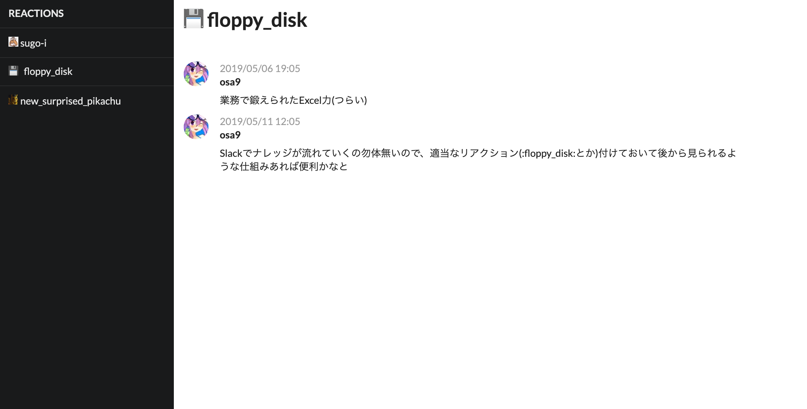

# Floppy
Archive Slack posts with reaction

# Requirements
- Slack API permisson (channels:history, emoji:read, reactions:read, users:read)
- Google Cloud Platform account

# Build
1. rename .env.template to .env and fill variable values
2. yarn docker:build
3. yarn docker:push
4. yarn gcloud:deploy